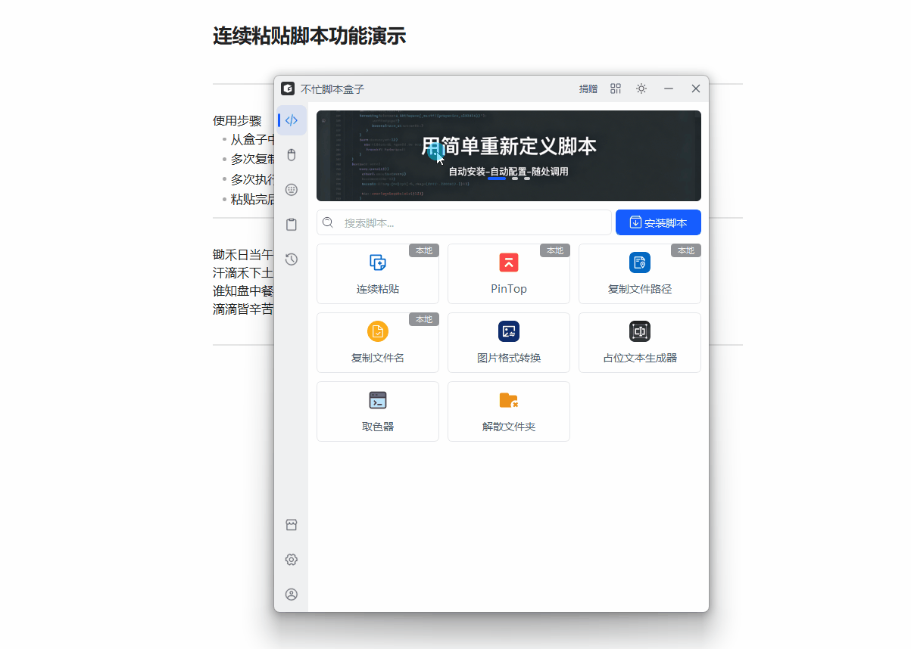

# 连续粘贴

> AutoHotkey v2 实现的剪贴板连续粘贴工具：自动记录复制内容，直接按 Ctrl+V 逐个顺序粘贴，告别反复切换窗口。

---

## 核心特性

- **批量复制，集中粘贴**：一次性复制多段内容，脚本自动按顺序入队，再统一逐条粘贴
- **原生 Ctrl+V，零学习成本**：不占用任何自定义组合键，按一下 Ctrl+V 粘贴一条，与平时操作完全一致
- **自动剪贴板监控**：每 300ms 轮询剪贴板，新复制的文本自动加入队列，无需任何操作
- **普通粘贴不受影响**：队列为空时 Ctrl+V 原样透传，无感恢复系统粘贴
- **托盘常驻，零打扰**：仅在系统托盘运行，图标悬停显示队列长度
- **气泡通知**：启动、粘贴完成、队列清空等状态通过不忙脚本盒子气泡提醒
- **自动退出**：托盘菜单一键开关，勾选后队列清空自动退出，不残留后台进程

---

## 脚本演示

选择需要连续粘贴的多段文字，依次复制，再切换到目标窗口按 Ctrl+V 即可逐条粘贴。

---

## 安装方法

本脚本的运行环境与触发均依赖「不忙脚本盒子」，建议仅通过盒子安装和使用。

> 前置条件：安装好 [不忙脚本盒子](https://www.bm-box.cn)

* 打开盒子 → **脚本市场** → 搜索 **「连续粘贴」**
* 点击「安装」，盒子自动配置 AutoHotkey v2 环境，装完即可使用

---

## 使用方式

* **单击启动**
  * 在盒子「已安装脚本」列表找到「连续粘贴」，单击运行
  * 脚本驻留托盘，复制文本即可自动入队
* **快捷键启动**
  * 在盒子里为脚本设置全局快捷键，一键唤起，随用随启

启动后粘贴操作：

1. 依次复制需要粘贴的多段文本，脚本按复制顺序自动记录
2. 切换到目标窗口，直接按 **Ctrl+V** 逐条粘贴（每按一次粘贴一条）
3. 队列清空后盒子气泡提醒，可在托盘菜单勾选「自动退出」让脚本自动结束

---

## 💡 使用提示

- **队列有内容时，Ctrl+V 粘贴的是队列下一项**：想恢复普通粘贴，先托盘「清空队列」
- **复制需在脚本启动后进行**：脚本只捕获运行期间的复制内容，启动前剪贴板里已有的内容不会入队
- **自动退出**：托盘图标右键 →「自动退出」开关，勾选后队列清空自动结束脚本
- **查看队列**：托盘图标右键 →「查看队列」，可预览每条文本内容
- **仅捕获文本**：剪贴板中的图片等非文本内容不会入队，复制文件会以文件路径文本形式入队
- **独立运行**：脱离盒子双击 `main.ahk` 也可使用，此时气泡通知回退为系统托盘提示

---

## 🖥️ 环境要求

| 项目       | 要求                         |
| -------- | -------------------------- |
| **操作系统** | Windows 10+                |
| **运行环境** | AutoHotkey v2（通过盒子安装时自动配置） |

---

## 更新日志

- 
- v1.2.4
  - 改直接拦截 Ctrl+V 连续粘贴，无自定义快捷键、零学习成本
  - 队列为空时 Ctrl+V 原样透传，普通粘贴不受影响
  - 移除设置窗口与录制快捷键功能，自动退出改为托盘菜单开关
  - 启动气泡提示「直接用 Ctrl+V 即可连续粘贴」
  
  
