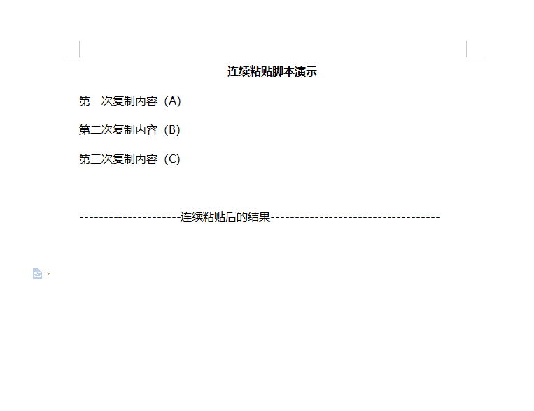

# 连续粘贴

> 自动记录复制内容，按快捷键逐个粘贴，告别反复切换窗口

## 1. 简介

在日常办公中，经常需要在多个窗口或文档间反复切换：复制一段 → 切换窗口 → 粘贴 → 切回去 → 复制下一段……这种重复操作非常耗时。**连续粘贴** 完美解决了这个问题：

- **批量复制，集中粘贴** — 一次性复制所有内容，脚本自动按顺序记录，然后统一粘贴
- **一键触发，逐条输出** — 按一次快捷键粘贴一条，按几次粘贴几条，一气呵成
- **无窗口干扰** — 仅在托盘运行，不干扰正常操作
- **AutoHotkey 实现** — 轻量原生，资源占用极低

## 2. 示例

选择需要连续粘贴的多段文字，依次复制，然后切换到目标窗口按下快捷键即可逐条粘贴。

## 3. 快速开始

- **自动安装（推荐）**
  
  - 下载 [不忙脚本盒子](https://www.bm-box.cn) 后，打开 → 脚本市场 → 搜索「连续粘贴」→ 点击安装。
  - 盒子会自动配置环境，安装后通过快捷键即可使用。

- **手动安装**
  
  - 需自行安装 [AutoHotkey v2](https://www.autohotkey.com/)，双击 `main.ahk` 运行。

## 4. 启动方式（通过盒子部署）

- **单击启动** — 打开不忙脚本盒子，在已安装脚本列表找到「连续粘贴」，单击即可运行。
- 

## 5. 全部功能一览

| 功能        | 说明                    |
| --------- | --------------------- |
| 自动剪贴板监控   | 每 300ms 轮询剪贴板，新内容自动入队 |
| FIFO 顺序粘贴 | 按复制顺序先进先出，不乱序         |
| 自定义快捷键    | GUI 设置窗口支持录制模式自定义组合键  |
| 队列状态提示    | 托盘图标悬停显示队列长度与当前快捷键    |
| 右键菜单      | 查看/清空队列、设置、重载、退出      |
| 自动退出      | 可选粘贴完成后自动退出脚本         |
| 自身粘贴过滤    | 自动过滤自身粘贴操作，避免重复入队     |

## 6. 更新日志

- v1.0.0（当前最新版）
  - 首次发布
  - 启动时自动生成 `config.ini`，无需手动创建
  - 默认 Ctrl+Numpad0 快捷键连续粘贴
  - GUI 设置窗口：自定义快捷键（录制模式）+ 开关自动退出
